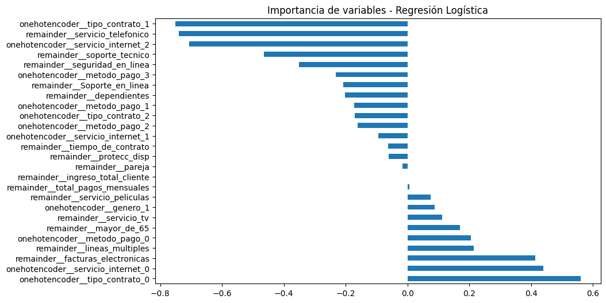
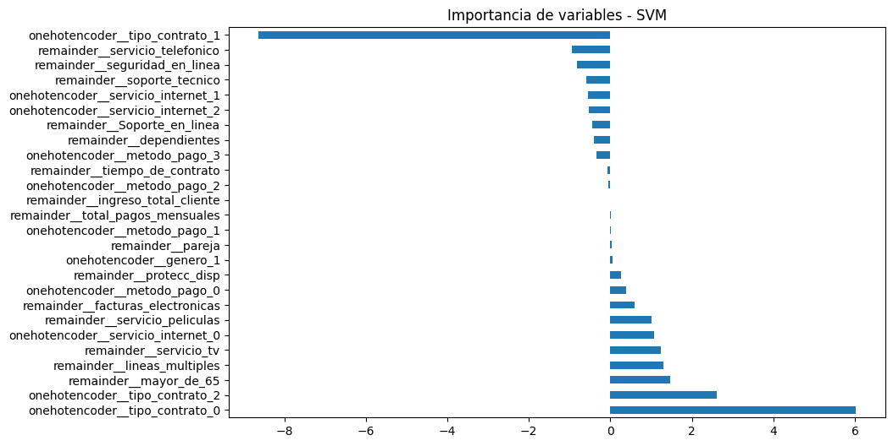
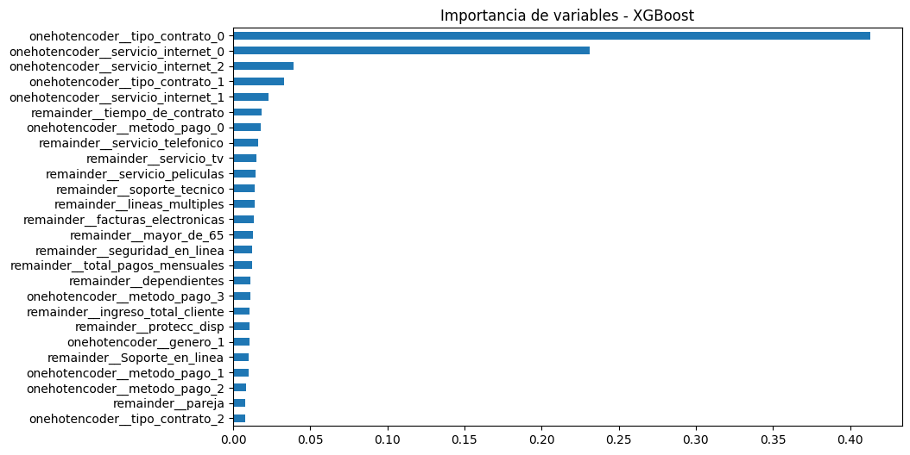

# 📊 Análisis de Cancelación de Clientes - Telecom X

Este proyecto tiene como objetivo identificar los factores más relevantes que influyen en la **cancelación de clientes (churn)** de Telecom X. A partir de un conjunto de datos reales, se aplicaron distintas técnicas de análisis exploratorio y modelos de machine learning para **predecir la cancelación y generar estrategias de retención**.

---

## Librerias Basicas que se necesitan para el proyecto

- pandas
- numpy
- matplotlib
- seaborn
- scikit-learn
- xgboost
- plotly

## 🗂️ Contenido del Proyecto

- Análisis Exploratorio de Datos (EDA)
- Preparación de datos y codificación
- Entrenamiento de modelos de clasificación:
  - K-Nearest Neighbors (KNN)
  - Random Forest
  - Regresión Logística
  - Support Vector Machine (SVM)
  - XGBoost
- Evaluación de modelos
- Análisis de variables más relevantes
- Conclusiones y recomendaciones estratégicas

---

## 📌 Exploración Inicial

Se evaluaron variables como:
- Antigüedad del cliente
- Servicios contratados (internet, telefonía, streaming, etc.)
- Métodos de pago
- Facturación
- Llamadas al servicio técnico

Ejemplo de visualización inicial de la proporción de cancelaciones:

---

## 🧠 Modelos de Machine Learning

### 🔹 Random Forest

### 🔹 Regresión Logística

### 🔹 SVM (Support Vector Machine)

### 🔹 XGBoost

---

## 🔍 Variables Más Relevantes

Según el análisis de importancia de características de los modelos anteriores, se destacan:

- **Duración del servicio (antigüedad)**: clientes nuevos cancelan más.
- **Soporte técnico**: malas experiencias aumentan la fuga.
- **Facturación y cobros automáticos**: cargos inesperados generan desconfianza.
- **Uso de servicios adicionales**: menor uso = mayor cancelación.

---

## ✅ Conclusión Estratégica

Con base en los resultados, recomendamos:

1. **Fidelización temprana:** Incentivos para clientes nuevos.
2. **Atención al cliente proactiva:** Mejora en soporte técnico y comunicación.
3. **Transparencia en tarifas:** Cobros claros y comparables.
4. **Paquetes personalizados:** Fomentar uso de servicios complementarios.

Estas acciones permitirán a **Telecom X reducir el churn**, mejorar la satisfacción de clientes y aumentar el valor de vida del cliente (CLV).

---

## 📁 Archivos incluidos

- `Desafio_TelecomX2_modelos.ipynb`: Notebook con modelos aplicados
- `imagenes/`: Carpeta con imágenes de gráficos
- `README.md`: Este documento explicativo
